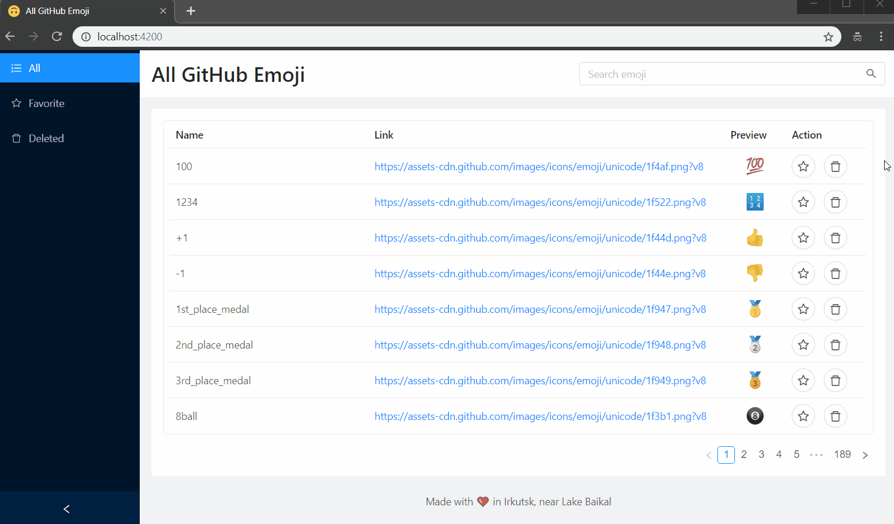

# 🙃 Angular GitHub Emoji List

[DEMO](https://baitun.github.io/ng-emoji)

## ✨ Features

* Fetch emojis from https://api.github.com/emojis
* State persists when page reloads
* Search by name of emoji

## 🤓 Other implementations of this task

* https://github.com/bree7e/ist
* https://github.com/SionGrey/ispsystem_test
* https://github.com/kirills98/ispsystem-test
* https://github.com/alexakan/ispSystem_testAngular
* https://github.com/PolyakovEI/angular-test-task
* https://github.com/sheldhur/sheldhur.github.io
* https://github.com/psevdomak/angular_emoji
* https://github.com/AlexSND/isp-test
* https://github.com/AVTomarev/angular-emojis-list-test-task
* https://github.com/TenHiderovich/ISPsystemTest
* https://github.com/PavelSOS1985/angular-project
* https://github.com/mleha/first-angular
